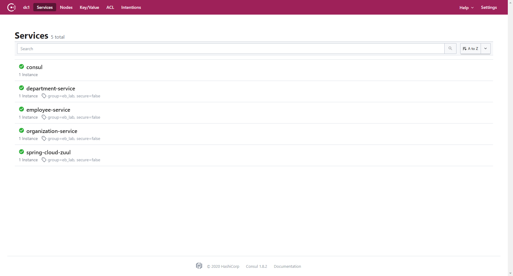
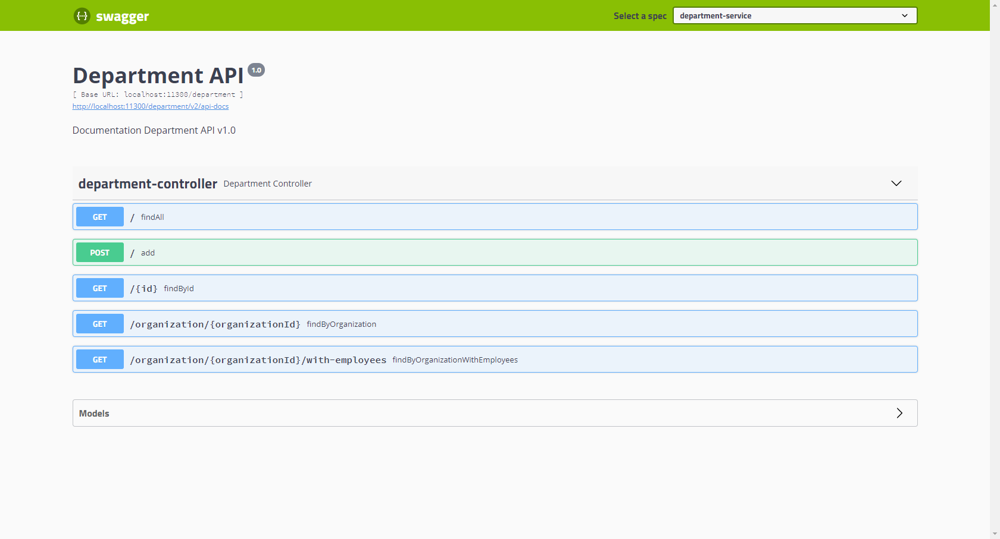
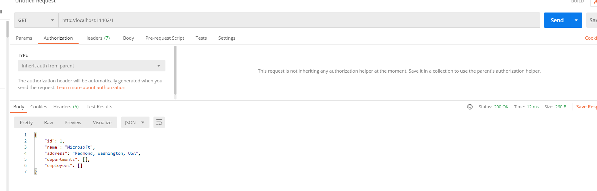

# 微服务 Demo 教程

## 主要内容

1. 熟悉 Git 相关操作
2. 配置微服务运行环境，运行该微服务 Demo
3. 在此基础上开发一个微服务接口

## 第一步：Git

1. Fork 该项目到自己的 Github 账号下
2. 新建一个新的分支，并在该分支上进行后续开发
3. 开发完毕后提交代码到自己的分支
4. 切换到 master 分支，并将之前开发所在分支的代码合并（merge）到 master 分支
5. 向该项目发起一个 Pull Request

## 第二步：微服务 Demo

### 演示说明

部署之前先阅读此篇[博文](https://gudaoxuri.gitbook.io/microservices-architecture/)，初步了解微服务的概念。文章不用全看完，看到“微服务的兴起”，感性的了解什么是微服务就好。通俗的讲，微服务就是分布式的功能模块。	

本demo以一个简单的人事管理系统作为演示，带大家实地部署一个微服务环境。分成三个微服务：公司（organization）——部门（department）——员工（employee）。每一个员工属于一个公司下的某个部门。三个微服务各自可以有很多复杂的功能，在本次演示中，为了方便，只包含对用内存模拟的数据库的增删查改。

注意，此微服务划分非最佳实践，仅供演示。

项目中，员工服务可能调用部门服务和公司服务的接口，部门服务可能调用公司服务提供的接口。具体的定义见`organization-service/src/main/java/com/eb/demo/organization/client`和`department-service/src/main/java/com/eb/demo/department/client`

### 环境与框架

开发工具：

* IDEA

开发环境：

* jdk1.8

部署环境：

* HashiCorp Consul（[下载链接](https://www.consul.io/downloads))
* Docker
* Docker-compose

### 启动

开发：

* 在 IDEA 中打开项目，点击 main 函数旁边的绿色箭头启动按钮

部署：

* 在项目根目录下运行`mvn package`生成jar包
* 在根目录下运行`docker-compose up -d`

### 运行截图

运行成功后，访问http://localhost:8500

访问localhost:11300/swagger-ui.html 进行接口调试，验证服务成功运行

还可以调用FeignClient中的接口验证服务之间可以相互访问

### 建议开发流程

* 先熟悉maven
* 从spring boot入手先熟悉java web开发

## 第三步：微服务接口

在该 Demo 基础上：
- 修改一个当前的接口；
- 新增一个新的接口，该接口需调用一个外部接口，外部接口可以是机器人问答类型（如图灵机器人）等；
